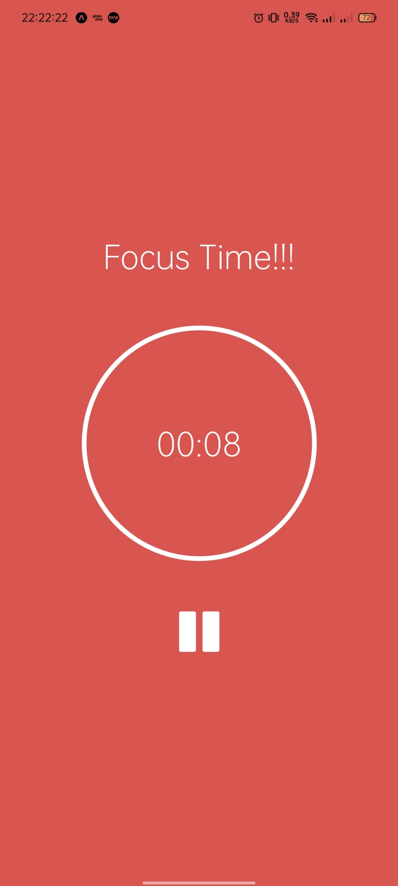

<h1 align="center">Pomodoro Timer</h1>

The pomodoro timer is a time management method. This technique consists of using a timer to divide the work into 25-minute periods, divided by quick breaks.

A Técnica Pomodoro é um método de gerenciamento de tempo. A técnica consiste na utilização de um cronômetro para dividir o trabalho em períodos de 25 minutos, separados por breves intervalos.

 

 &nbsp&nbsp&nbspScreenshots&nbsp&nbsp&nbsp  
  &nbsp&nbsp&nbsp&nbsp&nbsp&nbsp&nbsp
  

  

 &nbsp&nbsp&nbspProgramming Language&nbsp&nbsp&nbsp&nbsp&nbsp&nbsp&nbsp&nbsp&nbsp&nbsp&nbsp&nbsp&nbsp
 &nbsp&nbsp&nbsp Framework &nbsp&nbsp&nbsp  
 &nbsp&nbsp&nbsp&nbsp&nbsp&nbsp&nbsp&nbsp&nbsp&nbsp&nbsp&nbsp&nbsp&nbspTypescript &nbsp&nbsp&nbsp&nbsp&nbsp&nbsp&nbsp
 &nbsp&nbsp&nbsp&nbsp&nbsp&nbsp&nbsp&nbsp&nbsp&nbsp&nbsp&nbsp&nbsp&nbsp&nbsp&nbsp&nbsp&nbsp&nbspReact Native

